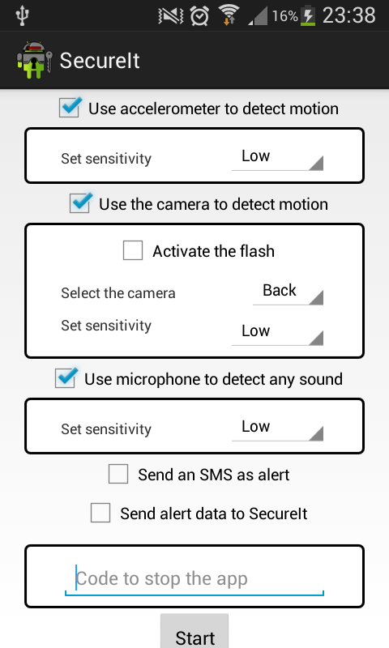
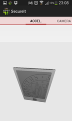
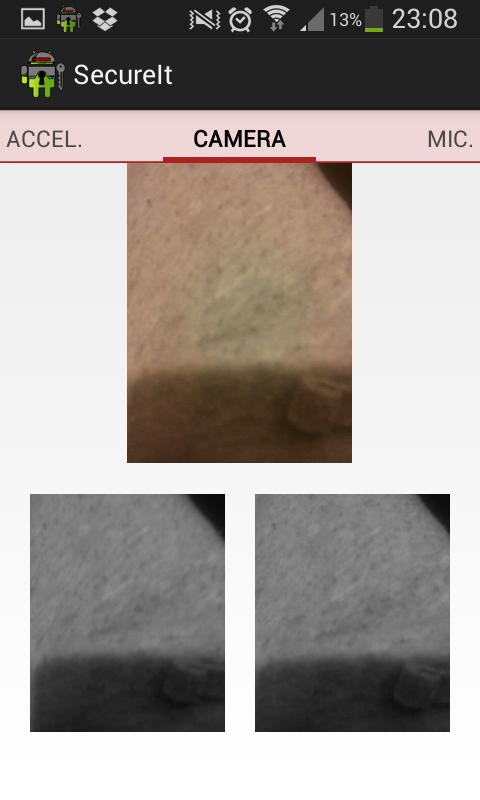
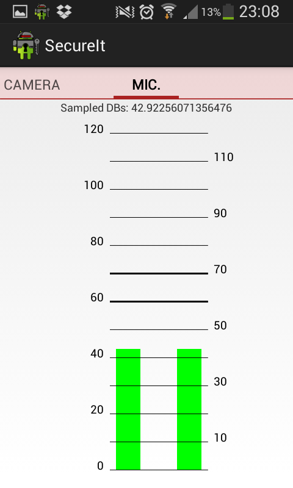

# SecureIt
Sample Android application that serves as a monitoring service by leveraging on device sensors. Among sensors exploited we report:

-   **Accelerometer**: used to detect phone's motion

-   **Camera**: used to detect motion in the phone's surroundings 

-   **Microphone**: used to detected noises in the enviroment

The source code is released open source to be used as a reference (possibly wrong) for your own code. The aim is to help fill in the gap between Javadoc documentation and real code samples.

# Building

The application can be built using Android Studio. Building has been tested with Android Studio 1.1.

# Usage

## Main view

Application's main view allows the user to set which sensors to use and the corresponding level of sensitivity. A security code must be provided, needed to disable monitoring. A phone number can be set, if any of the sensors is triggered a message is sent to the specified number.
Once monitoring is started a paged view gains focus with one fragment for each sensor. Each of these fragments gives a graphical representation of the corresponding sensor state.

## Accelerometer Fragment

The accelerometer page shows an OpenGL animation providing a graphic representation of phone's orientation. Fragment class is defined in `me.ziccard.securit.fragment.AccelerometerFragment`.

## Camera Fragment

The camera page containes three sub-views: 

- a SurfaceView provides real-time camera-captured images 

- an ImageView shows the last image considered by the motion detector

- an other ImageView shows the current image being considred by the motion detector

GUI classes are defined in `me.ziccard.securit.fragment.CameraFragment` 
and `me.ziccard.securit.Preview`.
Motion detection is performed via an asynchronous task defined in `me.ziccard.secureit.async` that leverages on classes in `me.ziccard.secureit.motiondetection`.

## Microphone Fragment

The microphone page provides a two-bar histogram of sound levels being captured by the mic and is defined in class `MicrophoneFragment`
Mic data is captured via an asynchronous task (`me.ziccard.secureit.async.MicSamplerTask`) and the class 
`me.ziccard.secureit.codec.AudioCodec`.

# Notifications

When one of the sensors is triggered (reaches the sensibility threshold) a notifications is sent through the following channels (if enabled).

- Wifi or Mobile Data: HTTP requests are sent to a server, including periodic updates of device location. Code can be found in package `me.ziccard.secureit.upload`

- Bluetooth: messages are sent to all listening nearby devices. Code can be found in packages `me.ziccard.secureit.{bluetooth, messages}`

- SMS: a message is sent to the number specified when monitoring started

Notifications are sent through a service running in background that is defined in class `me.ziccard.secureit.serviceUploadService`.

